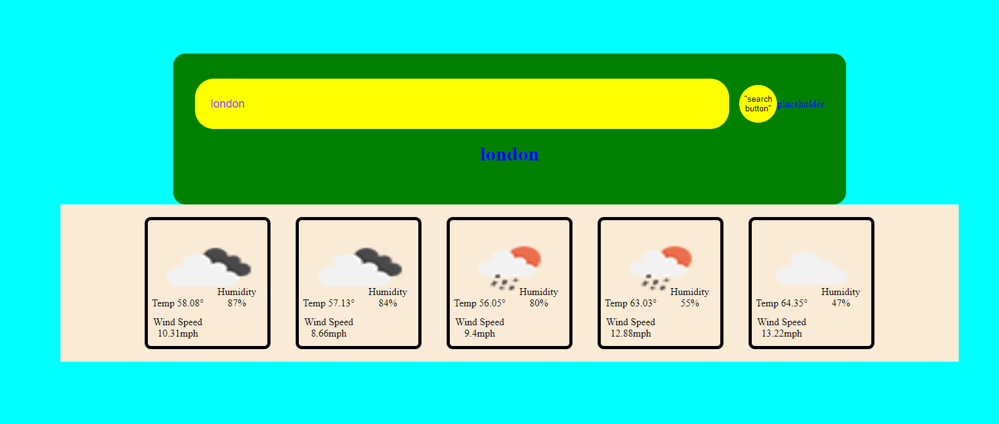

# jh-weather-channel
not done yet......

app is supposed to display the weather forecast for the next five days. once the city field is populated, weather data for that city is displayed on screen.

My favorite part working on this app is that I STILL DON'T FULLY UNDERSTAND FUNCTIONS AND LOOPS and I run into difficulties each time. I did enjoy passing text inputs into an api url.

need to display day, need to log input to local memory, need to improve the css as what is there is just basic to see different elements.

I got alot from these links, they were very helpful. 

cited links: 
https://www.google.com/search?q=making+a+5+day+weather+forecast+with+openweather+api+js&rlz=1C1UEAD_enUS947US947&oq=making+a+5+day+weather+forecast+with+openweather+api+js&gs_lcrp=EgZjaHJvbWUyBggAEEUYOTIJCAEQIRgKGKABMgkIAhAhGAoYoAEyCQgDECEYChigATIHCAQQIRiPAjIHCAUQIRiPAtIBCTEyMzk5ajBqNKgCALACAA&sourceid=chrome&ie=UTF-8#fpstate=ive&vld=cid:6ba6cad6,vid:QEu8_5bYm-w,st:0

https://discord.com/channels/@me/282910798668365825/1158188801424896030

github links:
https://github.com/lilcobby/jh-weather-channel

